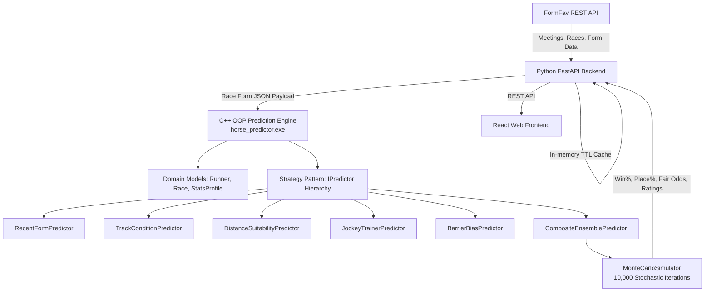

# HorseRacing Live — AI & C++ OOP Prediction Platform

A full-stack horse racing prediction and live analysis platform combining:
1. **FormFav REST API Integration**: Ingests live race cards, meetings across 24+ countries (Gallops, Harness, Greyhounds), track conditions, field stats, jockeys, trainers, barriers, and weights.
2. **C++ Object-Oriented Simulation Engine**: High-performance engine implementing OOP design patterns (Polymorphism, Strategy, Composite Ensemble) and running 10,000+ stochastic Monte Carlo race simulations to calculate Win%, Place%, Power Ratings, and Fair Odds.
3. **Interactive React Dashboard**: Modern, sleek web UI (Vite + Tailwind CSS + Lucide Icons) featuring a live meeting calendar, ranked prediction matrix with factor badges, detailed runner inspector, and an interactive Model Tuner studio.

---

## 🏗 Architecture & OOP Design Patterns



### C++ OOP Highlights:
- **Polymorphism & Strategy Pattern (`IPredictor`)**: Each rating model implements a common interface `evaluate(runner, race)` and `generateBadge(runner, race, score)`.
- **Composite Pattern (`CompositeEnsemblePredictor`)**: Blends individual sub-models using normalized weight vectors.
- **Monte Carlo Engine (`MonteCarloSimulator`)**: Simulates 10,000+ stochastic race runs using standard Gumbel extreme-value distributions to model real-world racing variance, yielding reliable Win and Place probabilities.

---

## 🚀 Quick Start

### 1. One-Click Launch (Windows)
Double-click `run_app.bat` or run:
```bash
./run_app.bat
```

### 2. Manual Startup

#### Step 1: Compile C++ Engine
```bash
cd cpp_engine
build.bat
# Creates horse_predictor.exe
```

#### Step 2: Start Backend
```bash
cd backend
pip install -r requirements.txt
python main.py
# Backend runs at http://127.0.0.1:8000
```

#### Step 3: Start Frontend
```bash
cd frontend
npm install
npm run dev
# Frontend runs at http://localhost:5173
```

---

## 📊 Features & Capabilities
- **Meeting Browser**: Switch dates (yesterday, today, tomorrow, custom calendar), filter by race type (`gallops`, `harness`, `greyhounds`), and select tracks.
- **Ranked Prediction Matrix**: View all runners ordered by Win Probability, Place Probability, C++ Power Rating, and Fair Odds.
- **Key Factor Badges**: Highlights "Last Start Winner", "Peak Form", "Condition Specialist", "Inside Draw Advantage", "Top Pick", "Value Bet", and "Dark Horse".
- **Model Tuner Studio**: Live sliders to dynamically adjust weights (Form, Condition, Distance, Jockey/Trainer, Barrier) and re-simulate with C++ on the fly.
- **Runner Modal**: Inspect runner career stats across good/soft/heavy ground, past 20 starts sequence, and individual C++ feature score breakdowns.
